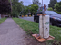
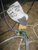

# How And Why To Gain Technological Advantages By Harvesting Entropy From An Unsuspecting Public

# 1 Intro

- I'm Karl Anderson

- I've been a software engineer for forever, and my career has had all kinds of highs and lows, from young ignorant to corporate drone to startup cowboy

- But I've had a very successful career so far, by which I mean I ususally end up with interesting work being a salaryman

- This despite spending much of 35 years working in some of the most unnatural environments for humans

- there are worse environments, of course

- but still, it took heavy conditioning to be able to work like this

- No matter what the work, it's hard to stay motivated working for a conference table full of VCs
- How have I adapted to this harsh environment?

- I started a phone company

3:00

# 2 Side Hustles

- a lot of people talk about side hustles to make money and I always envied them
- motivation to work on something when you don't know if it will work
- and a few of them make it big!

- But I don't have any business sense, or even aspiration
- So I didn't even try to make money

- Me and my co-founder started a phone company
- Seems like a good industry to break into, right?
- We had a differentiation strategy, though
- We deployed payphones in public locations and didn't charge for them

4:00 (1:00)

# 3 Futel

15:00 (11:00)

# 4 Motivation
- ok, so that's the basics about Futel
- what was the motivation for doing all this?
- back to the day job as a software engineer
- I actually like software engineering after 35 years as a career salaryman

- The career tracks of engineering professionals
- we're ignoring management here
- can be divided into two castes: the morlocks, whose toil designs the machinery upon which our society runs

- and the eloi, who are granted the freedom to explore the possibilities for which this machinery can elevate the human condition
- or at least make the investors richer.
- it's obvious which is the fun part

- some people can never get to the fun part
  - some don't have the skills or ability
    - some don't have the motivation, which I class as a skill
    - computer engineering is an unnatural activity
  - some don't have the capacity for what boils down to economic reasons
    - education, training, flexibility is a privilege

- some people seem to belong in the fun part
  - the person who not only works all the time, but works cleverly
  - the person with the soft skills to interact competitively

- but not me
- that was the priest class and I didn't see myself getting there
- This isn't literally true, of course

- but these are the big class boundaries that software engineers are taught to fear
- Was I one of the eloi? No! I have been a senior engineer for forever
- Was I a morlock? No! I jumped into the shit work and enjoyed it because I liked making things happen, but I wasn't stuck there

- but Futel gave me the opportunity to be one of those people
- really, it is a startup, we made something out of nothing by leveraging boring tech
- but not a startup that anybody with any common sense would want to join

- or anybody with pride, really, I'm not sure why I keep giving these talks
- and more importantly anybody who doesn't have the hours because they need to make a living or take care of a family

- it is a privelege to do this, capacity
- which is fine, let's just be up front about the barriers to entry

22:00 (7:00)

# 5 secret

So, it was easy to find a niche and start a project to address it, just do something that will never make money
- is this the secret to surviving the harsh environment of high tech engineering?
- no

- but it has been good career wise
  - it's a toy project for devops, the scaling challenges are simple, but
  - I get to show a 9 year project on my CV
  
  
  
  - I get to be an ops person, I always thought they were cooler

- I actually like being a software engineer

  - and it's the best work environment, like the real version of the fake motivational posters

25:00 (3:00)

# 6 benefits

What other benefits have there been?

- Because I often need to take stock and think about what something is giving and costing me
  - because I don't have good judgement about that, like many nerds who can get distracted by tech
  

  
  - and I like to work with things that I don't have skills or knowledge about
  - often stay aboard stupid projects for way too long
- So I tally up benefits once in a while

- I have been able to do new and different things

- and it has been a good thing to do

 - helpful to many, public service
 
 

 - positive presence that gets some people to think about community and their neighbors
 

 - in the end I have to be glad that I get to contribute some creative vision to the city

- phone hacking has a long history and it's fun to be a branch of that

- yeah, and we have a wikipedia page!
- and who knows, maybe it will be part of history someday

- You have to think about your audience for the life of the project

- maybe it will confuse post-apocalyptic archaeologists
- there could be a whole cult built around it

- so let's just assume this project is something I should do
- Enough about me, back to Futel

37:00 (12:00)

# 7 funding

How do we keep a project like this going
well, the only two resources in the world are money and time

* how is it funded
  * grants, donations, patreon
  
  
  
  * fiscal sponsor gives us 501c3
  

  
  * lots of labor involved in fundraising, I'm not on top of it
  
  
  
  * lots of expenses paid for by me and the other volunteers

42:30 (5:30)

# 8 time

  * lots of labor goes into Futel
    * need volunteers
    * need fundraising
    * need me doing everything that someone else doesn't do
- the project needs to attract people who want to work on it

- the other volunteers need to be benefitted also

* make it fun and interesting

  * do hacker things
  * learn skills
  - one guy did an internship
  

* make effects visible
  * metric usage so we can see effects
  * make us feel good about what we are doing
  
  
  
- social rewards

  - companionship
  - identification, community, belongingness
   

  - purpose
* have a presence to be associated with

  * let us toot our horns
    * honestly this is important
    * nobody likes a bragger and in this biz we all know empty boasters
    

 * it's important to let people get rewarded for their work
 * it's valuable to me to be associated with Futel
 * people have thanked me, one guy chased me down the sidewalk

59:00 (16:30)

# 9 in conclusion

Thank you for attending a soft skills talk at a tech conference
I hope it encourages some of yall to think about independent or mutual aid projects
